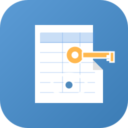

[](https://github.com/pstraebler/bitwarden-html-converter/actions/workflows/build.yml)

<p align="center">
  
</p>

# Bitwarden HTML Converter

Lightweight cross-platform application to convert Bitwarden JSON exports into printable HTML files.

## Features

- ✅ Simple and intuitive graphical interface
- ✅ Bitwarden JSON → HTML conversion
- ✅ Styled table optimized for printing
- ✅ Single binary with no dependencies
- ✅ Windows, macOS and Linux support
- ✅ Display all item types (logins, cards, identities, notes)

## Installation

### Download precompiled binaries

Go to the [releases page](../../releases) and download the binary for your system:

- **Windows**: `bitwarden-html-converter-windows-amd64.exe`
- **macOS Intel**: `bitwarden-html-converter-macos-amd64`
- **macOS Apple Silicon**: `bitwarden-html-converter-macos-arm64`
- **Linux**: `bitwarden-html-converter-linux-amd64`

### macOS/Linux

After downloading, make the file executable:

```bash
chmod +x bitwarden-html-converter-*
```

## Usage

1. Launch the application (double-click or via terminal)
2. Click "Select JSON File" and choose your Bitwarden export
3. Click "HTML Destination" and choose where to save the file
4. Click "Convert"
5. Open the generated HTML file in your browser to print it

## Export from Bitwarden

To get a JSON file from Bitwarden:

1. Open Bitwarden (application or browser extension)
2. Go to **Settings** → **Export Vault**
3. Choose **JSON** format (unencrypted)
4. Download the file

⚠️ **Warning**: The JSON file contains your passwords in plain text. Delete it after use.

## Build from source

### Prerequisites

- Go 1.21 or higher
- GCC (for Fyne CGO compilation)

#### Linux
```bash
sudo apt-get install gcc libgl1-mesa-dev xorg-dev
```

#### macOS
```bash
xcode-select --install
```

#### Windows
Install [TDM-GCC](https://jmeubank.github.io/tdm-gcc/) or use [MSYS2](https://www.msys2.org/)

### Compilation

```bash
git clone <repository-url>
cd bitwarden-html-converter
go mod download
go build -o bitwarden-html-converter
```

## Project structure

```
bitwarden-html-converter/
├── main.go              # Graphical interface
├── converter.go         # Conversion logic
├── go.mod              # Go dependencies
├── .github/
│   └── workflows/
│       └── build.yml   # Automated multi-OS build
└── README.md
```

## Technologies used

- **Go**: Programming language
- **Fyne**: Cross-platform GUI framework
- **GitHub Actions**: Automated build and release

## License

MIT

## Security

- This application does not collect any data
- No network connections are made
- Files are processed locally
- Source code is open and auditable

## Contributors

Contributions welcome! Feel free to open an issue or pull request.
